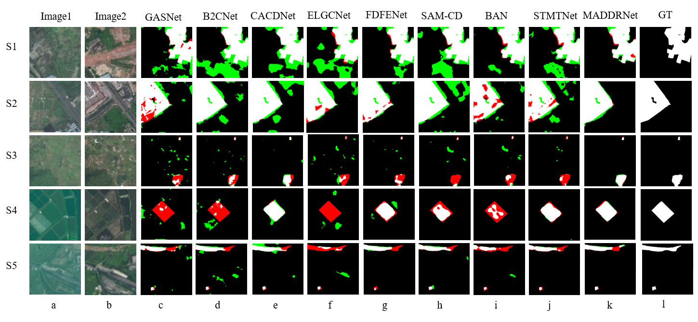
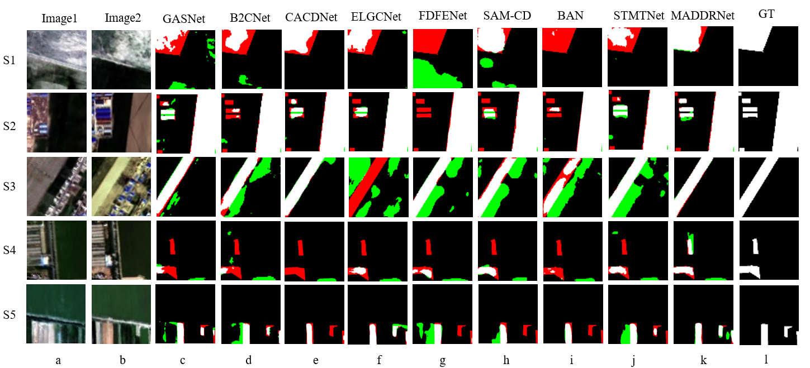
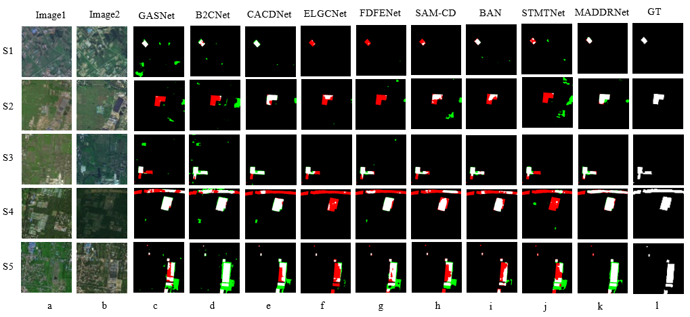
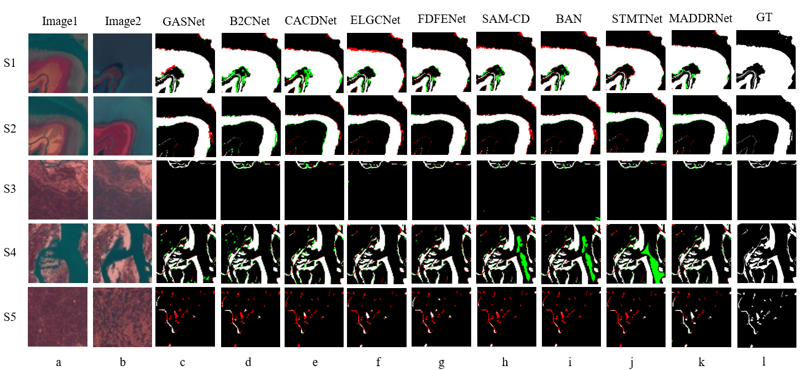

# MADDRNet: Synergizing VFM with Morphology-Aware Dual-Domain Resonance Network for Remote Sensing Change Detection

[](URL_TO_YOUR_PAPER)
[](https://opensource.org/licenses/MIT)

Official PyTorch implementation of **MADDRNet**.


## 👁️ Qualitative Results
Extensive experiments on four benchmark datasets (CLCD, GFSW-CLCD, LuojiaSET, and Water-CD) demonstrate that MADDRNet achieves state-of-the-art (SOTA) performance, showing excellent ability in preserving target morphology while suppressing climate-induced noise.

### 1. Results on CLCD Dataset
<p align="center">
  
</p>

### 2. Results on GFSW-CLCD Dataset
<p align="center">
  
</p>

### 3. Results on LuojiaSET Dataset
<p align="center">
  
</p>

### 4. Results on Water-CD Dataset
<p align="center">
  
</p>

*(Note: Red areas denote false positives, green areas denote false negatives, and white areas represent true positive changes.)*

---

## 🚀 Getting Started

### Prerequisites
- Python 3.8+
- PyTorch 1.12.0+ (or compatible versions)
- CUDA 11.6+

### Installation
```bash
git clone [https://github.com/wk448379-source/weihanming.git](https://github.com/wk448379-source/weihanming.git)
cd MADDRNet
pip install -r requirements.txt
